# Dossier Technique — Gestion de Tournois Sportifs (Five M2L)
## BTS SIO 2e année — Spécialité SLAM

**Projet :** Application web de gestion de tournois de football futsal  
**Stack :** PHP 8.4 + MySQL 8.x + WAMP  
**Pattern :** MVC avec PDO  

---

## 1. Présentation

Application web permettant de :
- Inscrire des équipes à des tournois (max 16/tournoi)
- Organiser Phase de poules (4 groupes de 4 équipes)
- Générer et suivre phases finales (QF → SF → Finale)
- Saisir résultats avec validation double
- Calculer classements automatiquement

---

## 2. Architecture MVC

### Partie 1 : Modèles (PDO)
- **ModelJoueur** : CRUD joueurs, authentification
- **ModelEquipe** : Gestion équipes
- **ModelTournoi** : Création/lecture tournois
- **ModelPhaseFinale** : Calcul classements finaux

**Sécurité :**
- Requêtes paramétrées PDO (prévention injection SQL)
- Hash bcrypt `password_hash(PASSWORD_DEFAULT)`
- `htmlspecialchars()` en sortie (XSS)

### Partie 2 : Contrôleurs
- **mainController** : Routage centralisé
- **AuthController** : Login/Signup (session régénérée)
- **TournoiController** : Gestion tournois
- **MatchController** : Saisie résultats double validation
- **AdminController** : Panel admin

### Partie 3 : Vues
- **layout.php** : Template principal
- **tournoi.php** : Affichage poules + classement final (🥇🥈🥉⚡)
- 5 autres onglets (accueil, équipe, stats, profil, admin)

---

## 3. Modèle de données (base `tournoi_five`)

```
JOUEUR (id_joueur, user, pw, is_admin, nom, prenom, poste, niveau, #id_equipe)

EQUIPE (id_equipe, nom, niveau, id_poule, code_acces, statut, #id_createur)

TOURNOI (id_tournoi, nom, date_debut, date_fin, statut)

INSCRIPTION_TOURNOI (#id_equipe, #id_tournoi, date_inscription, #id_poule, poule)

POULE (id_poule, nom_poule, #id_tournoi)

RENCONTRE (id_rencontre, #id_tournoi, id_poule, #id_equipe1, #id_equipe2, date_match, statut, phase,
           buts_equipe1_saisie1, buts_equipe2_saisie1, buts_equipe1_saisie2, buts_equipe2_saisie2,
           buts_equipe1_final, buts_equipe2_final, date_creation)

PHASE_FINALE (id_phase_finale, #id_tournoi, #id_match, phase, position_phase, created_at)

CLASSEMENT (id_classement)
```

> `#` = clé étrangère  
> `CLASSEMENT` est une table **non utilisée** dans le code (aucune requête SQL ne la cible) — les classements sont calculés dynamiquement depuis `RENCONTRE`

---

## 4. MCD (Modèle Conceptuel de Données)

```text
JOUEUR
- id_joueur
- user
- pw
- is_admin
- nom
- prenom
- poste
- niveau

EQUIPE
- id_equipe
- nom
- niveau
- code_acces
- statut

TOURNOI
- id_tournoi
- nom
- date_debut
- date_fin
- statut

POULE
- id_poule
- nom_poule

RENCONTRE
- id_rencontre
- date_match
- statut
- phase
- buts_equipe1_saisie1
- buts_equipe2_saisie1
- buts_equipe1_saisie2
- buts_equipe2_saisie2
- buts_equipe1_final
- buts_equipe2_final
- date_creation

PHASE_FINALE
- id_phase_finale
- phase
- position_phase
- created_at

Relations :
- Un JOUEUR crée 0,N EQUIPE ; une EQUIPE est créée par 0,1 JOUEUR
- Une EQUIPE contient 0,N JOUEUR ; un JOUEUR appartient à 0,1 EQUIPE
- Une EQUIPE s'inscrit à 0,N TOURNOI ; un TOURNOI reçoit 0,N EQUIPE
    via INSCRIPTION_TOURNOI(date_inscription, poule)
- Un TOURNOI contient 1,N POULE ; une POULE appartient à 1,1 TOURNOI
- Un TOURNOI contient 0,N RENCONTRE ; une RENCONTRE appartient à 1,1 TOURNOI
- Une POULE regroupe 0,N RENCONTRE ; une RENCONTRE appartient à 0,1 POULE
- Une RENCONTRE oppose exactement 2 EQUIPE
- Un TOURNOI possède 0,N PHASE_FINALE ; une PHASE_FINALE appartient à 1,1 TOURNOI
- Une PHASE_FINALE référence 1,1 RENCONTRE
```

**Remarque :** la table `CLASSEMENT` existe en base mais n'est pas exploitée par l'application. Les classements sont calculés dynamiquement à partir des rencontres.

---

## 5. UML complet (diagramme de classes)

```plantuml
@startuml
skinparam classAttributeIconSize 0

class "public/index.php" as FrontController <<router>> {
    +dispatch(action)
}

class database {
    -instance : PDO
    +Connexion() : PDO
}

class AuthController {
    +afficherInscription()
    +afficherConnexion()
    +deconnexion()
    +traiterInscription()
    +traiterConnexion()
}

class HomeController {
    +afficherAccueil()
}

class JoueurController {
    +afficherInscriptionJoueur()
    +afficherProfile()
    +traiterProfile()
}

class EquipeController {
    +afficherEquipe()
    +traiterCreerEquipe()
    +traiterAnnulerEquipe()
    +traiterRejoindreEquipe()
    +traiterQuitterEquipe()
}

class TournoiController {
    +afficherTournois()
    +traiterInscription()
}

class MatchController {
    +afficherSaisieResultat()
    +traiterSaisieResultat()
}

class PouleController {
    +generer()
    +voirPoules()
}

class PhaseFinaleController {
    +synchroniser(id_tournoi)
}

class StatsController {
    +afficherStatistiques()
}

class AdminController {
    +afficherPanel()
    +traiterCreerTournoi()
    +traiterSupprimerTournoi()
    +accepterEquipe()
    +refuserEquipe()
    +traiterEditerTournoi()
    +traiterEditerEquipe()
    +traiterSupprimerEquipe()
    +genererPoules()
}

class ModelJoueur {
    -_id_joueur : int
    -_nom_utilisateur : string
    -_password : string
    -_nom : string
    -_prenom : string
    -_poste : string
    -_niveau : string
    -_id_equipe : ?int
    +__construct(n_u, pw, n, pren, post, lvl, team)
    +setId(id)
    +setPassword(password)
    +setNomUtilisateur(nom)
    +setNom(name)
    +setPrenom(pren)
    +setPoste(post)
    +setNiveau(lvl)
    +setEquipe(team)
    +getIdJoueur()
    +getPassword()
    +getNomUtilisateur()
    +getNom()
    +getPrenom()
    +getPoste()
    +getNiveau()
    +getEquipe()
    +AjouterJoueur()
    +getUnJoueur(identifiant, mdp)
    +getJoueurByPseudo(pseudo)
    +getPwById(id_joueur)
    +getMonId()
    +getJoueurById(id_joueur)
    +updateJoueur(id_joueur, user, nom, prenom, poste, niveau, equipe)
    +updatePassword(id_joueur, newPassword)
    +updateEquipeJoueur(id_joueur, id_equipe)
    +quitterEquipe(id_joueur)
    +getJoueursParEquipe(id_equipe)
}

class ModelEquipe {
    -_id_equipe : int
    -_nom : string
    -_niveau : string
    -_id_poule : int
    +__construct(id_equipe, nom, niveau, id_poule)
    +setId(id_equipe)
    +setNom(nom)
    +setNiveau(niveau)
    +setPoule(id_poule)
    +getId()
    +getNom()
    +getNiveau()
    +getPoule()
    +getAllEquipes()
    +getNomEquipe(idTeam)
    +getCodeAcces(id_equipe)
    +getEquipesValidees()
    +getEquipeById(id_equipe)
    +creerEquipe(nom, code_acces, id_createur)
    +getEquipesEnAttente()
    +validerEquipe(id_equipe)
    +refuserEquipe(id_equipe)
    +getNbEquipesEnAttente()
    +modifierEquipe(id_equipe, nom)
}

class ModelTournoi {
    +getTournoisDisponibles()
    +creerTournoi(nom, debut, fin)
    +supprimerTournoi(id_tournoi)
    +estDejaInscrit(id_equipe, id_tournoi)
    +inscrireEquipe(id_equipe, id_tournoi)
    +getNbTournoisComplets()
    +getTournoiById(id_tournoi)
    +modifierTournoi(id_tournoi, nom, debut, fin)
    +enregistrerPoule(idTournoi, idEquipe, nomPoule)
    +getEquipesInscrites(idTournoi)
    +majPouleEquipe(idTournoi, idEquipe, lettrePoule)
    +updateStatut(idTournoi, nouveauStatut)
    +getProchainsTournois(limit)
    +getTournoiEnCoursEquipe(id_equipe)
    +getTournoisTermines()
    +getParticipantsTournoi(id_tournoi)
}

class ModelPoule {
    +getInscritsPourTirage(idTournoi)
    +assignerEquipeAPoule(idTournoi, idEquipe, lettrePoule)
    +getPoulesComplet(idTournoi)
}

class ModelMatch {
    +genererMatchsPoule(id_tournoi, poule)
    +getMatchsPoule(id_tournoi, poule)
    +saisirResultat(id_rencontre, id_equipe_saisie, buts_eq1, buts_eq2)
    +getMatch(id_rencontre)
    +getMatchsTournoi(id_tournoi)
    +getProchainsMatchsEquipe(id_equipe, limit)
    +getDerniersMatchsEquipe(id_equipe, limit)
    +getClassementPoule(id_tournoi, poule)
    +getClassementsTournoi(id_tournoi)
    +pouleTerminee(id_tournoi, poule)
    -appliquerDepartageConfrontationDirecte(id_tournoi, poule, classement)
    -getGagnantConfrontationDirecte(id_tournoi, poule, id_equipe_a, id_equipe_b)
    +phasePouleTerminee(id_tournoi)
    +phasesFinalesDejaGenerees(id_tournoi)
    +genererPhasesFinalSiPret(id_tournoi)
    +genererPhasesFinal(id_tournoi)
    -getVainqueurMatch(match)
    +genererDemiFinalesSiPret(id_tournoi)
    +genererFinaleSiPret(id_tournoi)
}

class ModelPhaseFinale {
    +creerTableSiNecessaire()
    -verifierSchemaConforme(pdo)
    +getPhasesFinalesTournoi(id_tournoi)
    +existePourTournoi(id_tournoi)
    +synchroniserTournoi(id_tournoi)
    -importerDepuisRencontreSiNecessaire(id_tournoi)
    +getClassementFinal(id_tournoi)
    -genererQuarts(id_tournoi)
    -genererDemiSiPret(id_tournoi)
    -creerDemiDepuisQuarts(id_tournoi, quartA, quartB, positionDemi)
    -genererFinaleSiPret(id_tournoi)
    -getMatchsParPhase(id_tournoi, phase)
    -phasePositionExiste(id_tournoi, phase, position)
    -getVainqueurRencontre(match)
}

FrontController ..> HomeController
FrontController ..> AuthController
FrontController ..> JoueurController
FrontController ..> EquipeController
FrontController ..> TournoiController
FrontController ..> MatchController
FrontController ..> StatsController
FrontController ..> AdminController
FrontController ..> PouleController

AuthController ..> ModelJoueur
HomeController ..> ModelTournoi
HomeController ..> ModelMatch
JoueurController ..> ModelJoueur
JoueurController ..> ModelEquipe
EquipeController ..> ModelEquipe
EquipeController ..> ModelJoueur
TournoiController ..> ModelTournoi
TournoiController ..> ModelPoule
TournoiController ..> ModelMatch
TournoiController ..> ModelPhaseFinale
MatchController ..> ModelMatch
MatchController ..> ModelPhaseFinale
PouleController ..> ModelPoule
PouleController ..> ModelTournoi
PouleController ..> ModelMatch
PhaseFinaleController ..> ModelPhaseFinale
AdminController ..> ModelEquipe
AdminController ..> ModelTournoi
AdminController ..> ModelPoule
AdminController ..> ModelMatch

ModelJoueur ..> database
ModelEquipe ..> database
ModelTournoi ..> database
ModelPoule ..> database
ModelMatch ..> database
ModelPhaseFinale ..> database
ModelPhaseFinale ..> ModelMatch

note bottom of FrontController
Le routeur réel du projet est le fichier public/index.php.
Il instancie les contrôleurs selon l'action demandée.
end note

note bottom of ModelPhaseFinale
Cette classe gère la table phase_finale,
la synchronisation du bracket et le classement final.
end note

@enduml
```



**Lecture du diagramme :**
- `public/index.php` joue le rôle de front controller / routeur principal.
- Les contrôleurs orchestrent les actions HTTP et délèguent la logique métier aux modèles.
- Tous les modèles dépendent de `database::Connexion()` pour accéder à MySQL via PDO.
- `ModelPhaseFinale` dépend aussi de `ModelMatch` pour exploiter les classements de poules avant de construire le tableau final.

---

## 6. Règles métier

### Phase de poules
1. **16 équipes** inscrites → réparties en 4 poules (A/B/C/D)
2. **6 matchs par poule** (round-robin)
3. **Classement** : Points (V:3, N:1, D:0) + différence buts
4. **Top 2 de chaque poule** → Quarts de finale

### Phases finales
```
8 équipes (2 de chaque poule)
    ↓
Quarts (4 matchs) → Demis (2) → Finale (1)
    ↓
Classement final : 🥇 Vainqueur, 🥈 Finaliste, 🥉 Demi-finalistes,
                   ⚡ Quart-finalistes, 📋 Éliminés en poules
```

### Saisie résultats (Double validation)
```
1. Équipe A saisit : 3-1
2. Équipe B saisit :
   - Si 3-1 → ✅ Validé, match terminé
   - Si 2-2 → ❌ Erreur, appel admin
```

---

## 7. Sécurité implémentée

✅ **Injection SQL** → Requêtes paramétrées (`$stmt->execute([':x' => $y])`)  
✅ **XSS** → `htmlspecialchars()` à l'affichage  
✅ **Mot de passe** → `password_hash(PASSWORD_DEFAULT)` + `password_verify()`  
✅ **Session** → `session_regenerate_id(true)` à la connexion  
✅ **Accès** → Vérification rôle admin côté serveur  

---

## 8. Fonctionnalités clés

**Joueur :**
- Inscription (pseudo/email/mot de passe)
- Rejoindre équipe (code d'accès)
- Participer tournois (voir poules, classements)
- Saisir résultats matchs

**Admin :**
- Valider équipes
- Créer/éditer tournois
- Lancer tirage → génération auto 4 poules + 24 matchs
- Générer phases finales auto
- Voir stats

---

## 9. Exemple : Génération tournoi

```php
// ModelTournoi.php
public static function creerTournoi($nom, $date_debut) {
    $pdo = Database::connect();
    $stmt = $pdo->prepare("INSERT INTO tournoi (nom, date_debut, statut) 
                           VALUES (:nom, :date, 'ouvert')");
    $stmt->execute([':nom' => $nom, ':date' => $date_debut]);
    return $pdo->lastInsertId();
}

// TournoiController.php → lancé par admin
if ($_POST['action'] == 'generer_poules') {
    $tirage = ModelTournoi::genererPoiulesAuto($_POST['id_tournoi']);
    // Répartit 16 équipes en 4 poules, crée 24 matchs
}
```

---

## 10. Classement final (tournoi terminé)

```php
// ModelPhaseFinale.php
public static function getClassementFinal($id_tournoi) {
    // Extrait gagnant finale (1er), finaliste (2e)
    // Extrait perdants demi-finales (3,4)
    // Extrait perdants quarts (5-8)
    // Reste = éliminés poules (9-16)
    return ['vainqueur' => ..., 'finaliste' => ..., ...];
}
```

Affichage en table avec couleurs (🥇 or, 🥈 argent, 🥉 bronze, ⚡ cyan, 📋 gris)

---

## 11. Fichiers importants

```
/config/database.php          → PDO singleton
/models/
    ModelJoueur.php
    ModelEquipe.php
    ModelTournoi.php
    ModelPhaseFinale.php
/controllers/
    mainController.php        → Routage
    AuthController.php        → Auth
    TournoiController.php     → Tournoi + classements
    [...]
/views/
    layout.php                → Template général
    tabs/tournoi.php          → Affiche poules + final
/public/index.php             → Point d'entrée
/public/css/style.css         → Styling (final ranking colors)
```

---

## 12. Déploiement

### Local
- PHP 8.4 + MySQL 8.0
- WAMP Server
- http://localhost/Projet_PPE1/public/

### Production
- VPS Linux + PHP-FPM + Nginx
- MySQL sécurisé (remote)
- HTTPS obligatoire

---

## 13. Conclusion

Application web robuste respectant les standards BTS SIO SLAM :
- ✅ **MVC** strict (Modèle/Vue/Contrôleur)
- ✅ **Sécurité OWASP** (requêtes paramétrées, hash, XSS)
- ✅ **Base normalisée** (8 tables essentielles)
- ✅ **Cycle métier complet** (inscriptions → poules → finales → classement)
- ✅ **Validation** (double saisie résultats)
- ✅ **Code source** documenté et fonctionnel

---

**Date** : 31 mars 2026  
**Auteur** : Équipe PPE  
**Entreprise** : Five M2L  
**Version** : 1.0 Simplifiée
